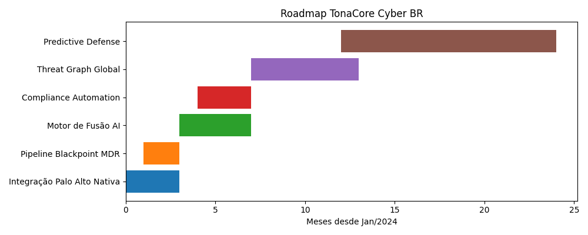

# TonaCore Cyber BR

TonaCore Cyber BR é uma plataforma unificada de correlação, fusão de inteligência
e resposta automatizada a incidentes de segurança, projetada para ambientes
enterprise e críticos.

## Principais Capacidades
- Correlação em tempo real de múltiplas fontes
- Fusão de inteligência baseada em contexto
- Integração nativa com líderes de mercado
- Automação de resposta orientada a risco
- Conformidade regulatória automatizada

## Roadmap

## Estrutura do Projeto
Veja a organização detalhada em `docs/ARCHITECTURE.md`.
